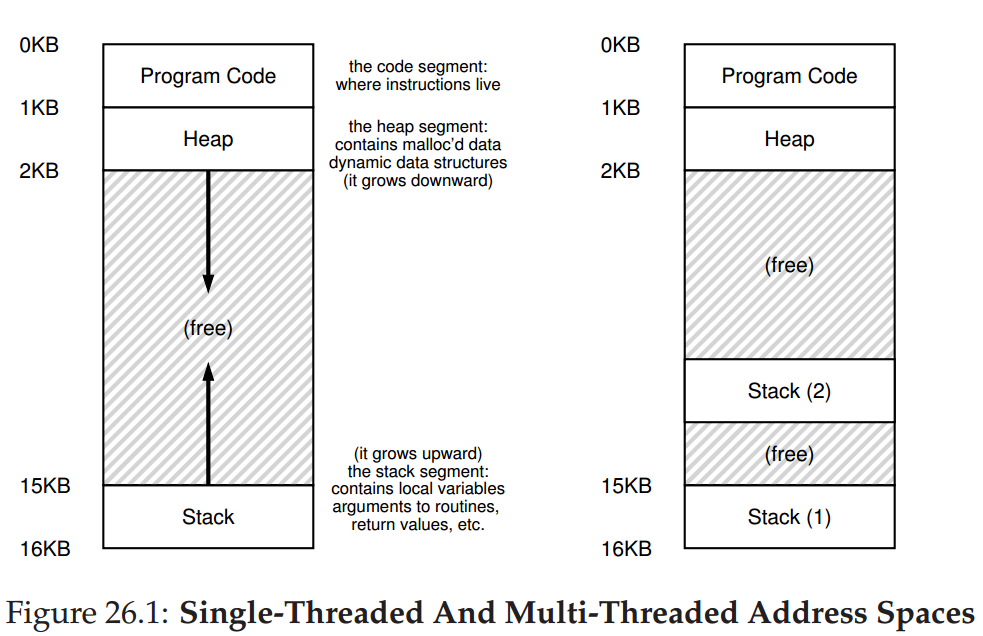

# 26 并发：介绍


## 引言
到目前为止，我们已经知道了操作系统基本执行部件的抽象概念的发展。我们已经了解如何**使用**单个物理CPU并将其抽象成多个虚拟CPU，因此多个程序看似同时运行成为了可能【注：在单个单核CPU上，同一时刻实际上只有一个程序在运行】。我们也学习了如何为每个进程构建一个看似很大且私有的虚拟内存；地址空间的抽象概念让每一个程序都好像有了自己的内存，而实际上是操作系统暗地里跨物理内存复用了地址空间（有时是磁盘）。

本节，我们将为单个正在运行的进程引入一个新的概念：**线程**。不像先前一个程序内只有一个执行点的视角（只从一个PC寄存器取指令和执行指令），一个**多线程**程序不止一个执行点（多个PC寄存器，可以从每一个PC取指令和执行指令）。从另一个角度来思考这个问题，每一个线程很像一个独立的进程，但是与进程的区别是：进程内的各个线程共享相同的地址空间。所以各个线程可以访问相同的数据。

单个线程的状态与进程的状态的很类似，有一个程序计数器（PC）来跟踪程序从何处取指令。每个线程有自己的用于计算的寄存器集；因此，如果在单个处理器上运行着两个线程，当从一个线程（T1）切换到另一个线程（T2）时，就会发生一次**上下文切换**（Context Switch）。线程的上下文切换跟进程的上下文切换很类似，因为需要保存T1的寄存器状态，并在T2运行之前加载T2的寄存器状态。对于进程来说，我们将状态保存到进程控制块（process control block，PCB）；对于线程来说，我们需要一个或多个线程控制块（thread control blocks，TCBs）来存储单个进程中的多个线程的状态。尽管如此，线程间的上下文切换比起进程来，有一个重要区别：地址空间依旧保持不变（没有必要切换正在使用的页表）。

线程与进程之间的另一个重要的区别是栈（stack）。在经典进程（现在可以称之为单线程进程，single-threaded process）地址空间的简单模型中，有一个单独的栈，通常位于地址空间的的底端（见下左图）。



然而，在多线程进程中，每个线程独立运行，当然会调用各种各样的routines来完成它正在做的任何工作。跟地址空间中只有一个栈不同，多线程进程中每个线程都有一个栈。假设一个多线程进程内有两个线程，其相应的地址空间与经典进程不一样（见上右图）。

在Figure26.1中，可以看到两个栈分布在进程的"整个"地址空间中。因此，任何在栈中分配的变量、参数、返回值以及其他存放在栈中的数据将会存储在那个有时称作线程局部空间的地方，即相应线程的栈。

也许你也注意到了新的布局破坏了原来"美观"的地址空间布局。之前，堆栈可以各自独立增长而不出问题，除非超出了地址空间的范围。而现在的地址空间布局就不再有先前的"nice situation"。幸运的是，这样的空间布局通常是可行的，因为栈一般不需要特别大（程序大量使用递归时除外）。

## 例子：线程创建
假设我们想运行一个创建两个线程的程序，每个线程各自执行相互独立的任务，打印「A」或「B」。代码如Figure 26.2所示。

主程序创建两个线程，每个都执行函数mythread()，但是传递不同的参数（字符串『A』或『B』）。一旦创建了线程，它可能会立即运行（取决于调度器的whims）；也可能会进入**就绪**态而非**运行**态，因此不立即执行。创建两个线程之后（T1和T2），主线程调用pthread_join()等待对应的线程结束。


我们来看一下这个小程序可能的执行顺序，在执行示意图中（表 26.1），时间从上向下依次增长，每一栏显示了什么时候运行不同的线程（主线程、线程T1、或线程T2）。

然而，注意这个顺序并不是唯一的执行顺序。实际上，对于一个给定的指令序列，它有不少的可能执行顺序，这取决于在特定的时刻调度器决定哪个线程能得到执行。比如，一旦创建了一个线程，它可能立即执行，如表26.2所示的执行顺序。

我们也可以看到**B**在**A**之前打印出来，这就是说调度器决定先执行线程T2，即使线程T1更早创建；没有任何理由取假设先创建的线程就先运行。表26.3显示了这个执行顺序，线程T with Thread 2 getting to strut its stuff before Thread 1.

As you might be able to see, one way to think about thread creation is that it is a bit like making a function call; however, instead of first executing the function and then returning to the caller, the system instead creates a new thread of execution for the routine that is being called, and it runs independently of the caller, perhaps before returning from the create, but perhaps much later. 

As you also might be able to tell from this example, threads make life complicated: it is already hard to tell what will run when! Computers are hard enough to understand without concurrency. Unfortunately, with concurrency, it gets worse. Much worse.


## 26.2 为何更糟糕：共享数据
上一节简单的线程示例可以有效的解释线程是如何被创建，以及它们是如何按照不同的顺序运行，这个执行顺序决定于调度器决定如何运行它们。这个示例并没有展示线程间在访问共享数据时是如何交互的。

让我们设想一个简单的例子：有两个线程想要更新一个全局共享变量。我们将要研究的代码见Figure 26.3。

有几个关于这段代码的注释。第一，如Stevens的建议[SR05]，我们封装了线程的create和join例程与其失败退出判断，对于一个简单如此的程序，我们至少要关注发生的错误（如果发生的话），但是不做任何很机智的事儿（如：仅仅退出）。因,pthread_create()简单的调用pthread_create()并确定返回值为0；如果不是，pthread_create()仅仅打印一个消息并退出。

第二，这个例子为工作线程仅用一个函数而不是两个独立的函数（即两个线程执行同一个函数，译者注），向线程传递一个参数（这里是字符串）让每一个线程在其消息之前打印不同的字母。

最后也是最重要的，我们可以看每个工作线程试图做的事：共享变量counter加1，这个操作在循环中执行一千万次。因此，理想的最终结果是：20,000,000。

现在编译执行这个程序，看一下它的结果。有时候，everything works how we might expect：
```
prompt> gcc -o main main.c -Wall -pthread
prompt> ./main
main: begin (counter = 0)
A: begin
B: begin
A: done
B: done
main: done with both (counter = 20000000)
```

不幸的是，当我们运行这段代码时，即使是在一个处理器上，我们也得不到那个预期的结果。有时，结果如下：
```
prompt> ./main
main: begin (counter = 0)
A: begin
B: begin
A: done
B: done
main: done with both (counter = 19345221)
```

我们再试一次，看看是不是我们疯狂了。毕竟，如你所接受的教育，计算机并不认为会产生确定性结果。也许你的处理器欺骗了你？（等我喘口气）
```
prompt> ./main
main: begin (counter = 0)
A: begin
B: begin
A: done
B: done
main: done with both (counter = 19221041)
```

不仅每一个都是错误的结果，而且每个结果还不一样！大大的疑问：为什么会发生这样的事儿呢？


> 技巧：了解并使用你的工具
> 
> 你总是需要学习心得工具来帮助你编写、调试和理解计算机系统。这里我们使用一个小巧的工具：反汇编器（disassembler）。当你对一个可执行文件执行反汇编时，它会显示这个可执行文件是有哪些会变代码组成的。例如，如果你希望理解例子中更新counter的底层代码，运行objdump（Linux）来它的汇编代码：
> ```
> prompt> objdump -d main
> ```


## 26.3 核心问题：失控的调度
为了理解为何会发生这样的事儿，我们需要理解编译器为更新counter而生成的指令序列。在这个例子里，我们希望简简单单的将counter加1。因此，做这一操作的指令序列也许应该如下（x86）：
```
mov 0x8049a1c, %eax
add $0x1, %eax
mov %eax, 0x8049a1c
```
这个例子假设变量counter分配的地址是0x8049a1c。在这个三指令的序列里，x86的mov指令首先取得该地址的内存值并将其放入寄存器eax中，然后，执行add操作，eax寄存器的值加1，最后，eax的值写回原先的内存地址。

我们设想一下两个线程中的一个（线程T1）进入这段代码，它对counter执行了加1操作。它首先加载counter的值（假设其初值是50）进入寄存器eax，因此对线程T1来说寄存器eax的值为50。然后它对寄存器执行加1操作，此时eax的值是51。现在，发生了件不幸的事儿：定时器中断到达；因此，操作系统保存当前运行线程的状态（PC，eax等寄存器）至线程的TCB。

现在发生了更糟糕的事儿：线程T2被调度执行，它进入同一段代码。它也执行第一条指令，获取counter的值并写入它的eax寄存器（注：每个线程在运行时都有自己私有的寄存器；这些寄存器是通过上下文切换代码保存、加载虚拟化出来）。counter的值此时仍然是50，因此线程T2的eax值为50。假设线程T2继续执行接下来的两条指令，eax加1（eax=51），然后保存eax的内容至counter（内存地址0x8049a1c）。因此，全局变量counter此时的值是51。

最后，又一次发生上下文切换，并且线程T1得到了执行。记得刚才仅仅执行过了mov和add指令，那么此时应当执行最后一条mov指令。刚才eax的值是51，因此，最后执行mov指令并将值写入内存；counter的又一次被写为51。

简单的说，事儿是这样的：counter加1的代码执行了两次，但是初值为50的counter现在只有51。但是这个程序『正确的』结果应当是变量counter值为52。

我们来看一下详细的执行路径以便更好的理解这个问题。对于这个例子，假设上述的代码加载到内存地址100处，如下图所示的指令序列（注意那些曾经优秀的精简指令集：x86有变长指令；这里的mov指令占5字节的内存，add指令仅占3字节）：
```
100 mov 0x8049a1c, %eax
105 add $0x1, %eax
108 mov %eax, 0x8049a1c
```
基于这些假设，上述发生的事儿如表26.4所示。假设counter起始值是50，然后跟踪这个例子确保你可以理解正在发生什么。


上面已经示范的问题称作：竞争条件，其结果取决于这段代码的执行时机。有时候运气不好（例如：在执行的时候发生不合时宜的上下文切换），就会得到错误的结果。实际上，我们很可能每次都得到不同的值；因此，而不是确定性计算（曾经来源于计算机？？），我们称之为不确定性，不知道输出的会是什么，且这些输出在交叉运行之间很可能会不同。

因为多线程执行这段代码会引起竞争条件，我们称这段代码为：临界区。一个临界区是一段访问共享变量（更一般的；共享资源）且不可被多于一个线程并发执行的代码段。

对于这段代码，我们需要的是称之为互斥量的东西。这个性质保证了如果有一个线程正在执行临界区代码，其他的线程都会被阻止进入临界区。

顺便提一下，实际上所有这些概念都是由Edsger Dijkstra创造出来的。他是这个领域的开拓者，并凭借这个工作和其他成果获得了图灵奖；详见他1968年的论文『Cooperating Sequential Processes』[D68]中对此问题惊人清晰的描述。我们还会在本章中多次看见Dijkstra。

## 26.4 原子性的愿望
解决这个问题的一个办
法是更强大的指令，这些指令可以在单步之内做任何我们需要做的，因此避免了发生不合时宜的中断的可能性。例如，假如我们有一个像下面所示一样的超级指令，会怎样呢？
```
memory-add 0x8049a1c, $0x1
```
假设这条指令将一个值加到该内存地址，并硬件保证它是原子执行的；当这条指令执行后，它将按照预想的那样执行更新操作。它不会在指令执行中被中断，因为正是我们从硬件那儿得到的保证：当中断发生时，这条指令要么没有执行，要么已经执行结束；没有中间状态。硬件可以如此的美好，不是么？
在此文中，原子性意味着『作为一个单位』，有时称之为『全或无』。我们想原子地执行这三条指令序列：
```
mov 0x8049a1c, %eax
add $0x1, %eax
mov %eax, 0x8049a1c
```

如之前所说的，如果有一条单独指令能够完成这个操作，那么只需要发出指令即可完成。但是通常情况下，没有这样的指令。设想我们已经构建了一个并发的B树，此时想要更新它；难道要硬件支持『B树的原子更新』指令么？恐怕不可能，至少在合理的指令集中是如此。

因此，相反的，由硬件提供少量有效的指令，我们可以借助这些指令构建一系列通用的同步原语。通过这些硬件同步原语与操作系统的支持，我们可以构造出以同步可控方式访问临界区的多线程代码，因此可以可靠的生成正确的结果，尽管存在并发执行的挑战。相当的棒，是不？

这是本节将要研究的问题。这是一个奇妙也很难的问题，应该会让你（有点）头疼。如果没有头疼，那就是你没懂！继续研究直到你头疼为止，那时候你就知道自己已经走向了正确的方向。到了那个时候，休息一会儿，我们可不想让你头疼的厉害。


症结所在：如何为同步提供支持

为了构建有效的同步原语，我恩需要硬件提供什么支持呢？又需要操作系统提供什么支持呢？我们怎么才能正确高效的构建这些原语呢？程序又如何使用他们以得到期望的结果呢？

> 关键并发术语
这四个术语对于并发代码太核心了，以至于我认为非常值得把它们提出来说一下。详见Dijkstra早期的工作[D65,D68]。
> * 临界区，临界区是一段访问共享资源的代码段，共享资源一般是一个变量或数据结构
> * 竞争条件，竞争条件发生在正在执行的多个线程几乎同时进入临界区；多个线程都试图更新共享数据结构，同时导致产生奇怪（可能非预期）的结果。
> * 不确定性，一段不确定的程序有一个或多个竞争条件组成，一次一次执行的输出变化不一，视不同线程何时运行而定。因此结果是不确定的，通常我们指望着计算机系统。
> * 互斥，为了避免这个这些问题，线程需要使用某种互斥原语；以此保证只有一个线程已经进入临界区，从而避免竞争得到确定性的结果。


## 26.5 另一个问题：等待其他线程
本章所设定的并发问题，线程间貌似只有一种交互形式，即访问共享变量以及临界区原子性的支持。事实证明，还会产生另一种常见的交互，即一个线程必须等待其他线程完成某些操作方能继续执行。例如，当一个进程执行磁盘I/O时而休眠时，这种交互就会产生；当磁盘I/O完成时，进程需要从休眠中唤醒以便继续执行。
因此，在接下来的章节中，我们不仅仅会研究如何构建同步原语为原子性提供支持，还会研究相应的机制来为多线程程序中常见的休眠唤醒交互方式提供支持。
要是现在这东西没有意义，那好！当你读到条件变量那章时就会觉得有意义了。如果那时觉得不太行，那你应该一遍再一遍的读那章直到觉得有意义。

## 26.6 小结：为什么在OS级
在wrapping up之前，你可能有一个疑问：为什么我们要在OS这一层研究这些？答案就一个词——历史；操作系统是第一个并发程序，许多技术都被创造用于OS中。后来，在多线程进程中，应用程序编写者也不得不考虑这些事儿。

例如，设想这样的场景，有两个正在运行的进程。假如它们都调用write()来写一个文件，都想将数据附加到文件中（例如：添加数据到文件末尾，从而增加它的长度）。这样的话，两者都需要分配一个新的块，记录块的位置到文件的inode中，并改变文件大小以示一个更大的大小（我们将会在本书第三部分学到更多关于文件的内容）。因为中断可能随时都会发生，更新这些共享数据结构的代码就是临界区，因此，从最开始的中断介绍可知，操作系统设计者不得不担心操作系统怎么更新这些内部结构。一个不合时宜的中断引起了上述的所有问题。不奇怪，页表，进程列表，文件系统结构等。实际上，所有内核数据结构都需要通过合适的同步原语来谨慎访问，以便正确工作。


> 技巧：使用原子操作
> 
> 原子操作是构建计算机系统最强大的底层技术之一，从计算机体系结构到并发代码（本节正在研究的）、文件系统（后面将会研究的）、数据库管理系统，甚至分布式系统[L+93]。
使得一系列行为原子化背后的思想可以简单的缩成一个短语——全或无。你希望一起执行的行为要么全都发生了，要么全都没有发生，而没有中间状态。有时，将许多行为组织成一个原子行为称作：事务，这个思想在数据库和事务处理领域已经发展很成熟[GR92]。
在探索并发性的主题中，我们会使用同步原语把短指令序列转化成原子执行块。但是如我们将会见到的，原子性的思想远不止这些。例如，文件系统使用诸如日志或copy-on-write等技术来原子地转移它们的磁盘状态，使得在面对系统故障时能严格正确地执行。If that doesn’t make sense, don’t worry—it will, in some future chapter。


